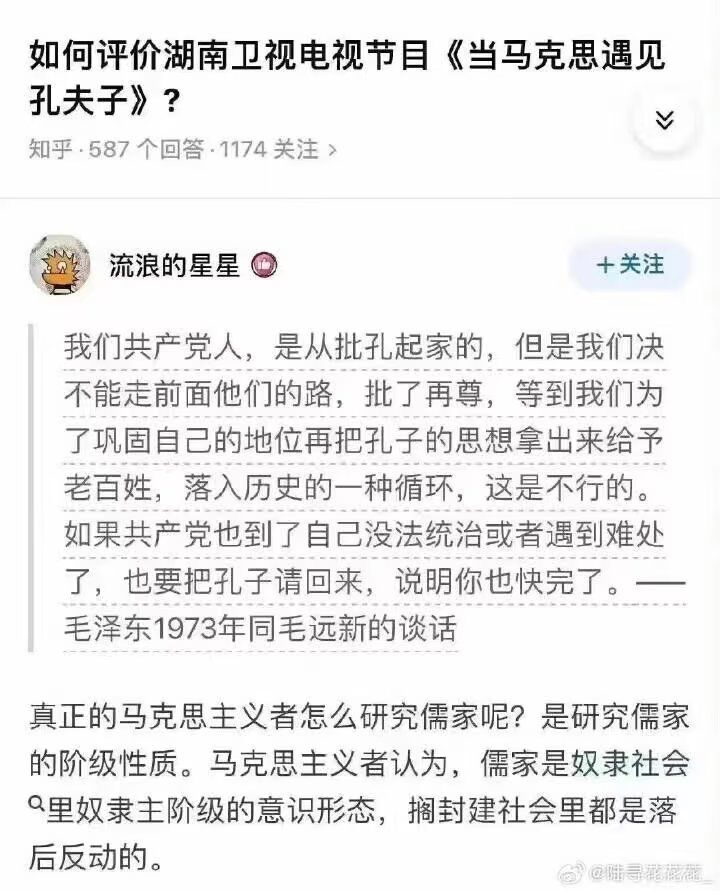

#### 马克思-孔夫子

>
>  
> 
> 佛陀宣讲佛法四十九年已毕，魔王波旬劝世尊速入涅槃。
> 
> 佛陀见诸弟子已成就佛法，所以应承，魔王波旬欢呼雀跃。
> 
> 佛陀见魔王自以为得逞，于是说：“我有经书留世，可以使你不能蛊惑世人”
> 
> 波旬道：“经书是死物，需有人宣说解释。”
> 
> 佛陀说：“我有僧宝留世。”
> 
> 波旬道：“佛法普渡一切众生，我魔王的弟子也可以接受世尊的教化吧？”
> 
> 佛陀称是。
> 
> 波旬于是大笑道，“自你入灭之后，我要叫我的徒子徒孙，混入你的僧宝，穿着你的袈裟，破坏你的佛法，曲解你的经典，到那时我要叫你的真法不显，伪经广传。”
> 
> 佛陀闻言，只有默然垂泪而已。
>
> 
> 
> 
> 

> 
> 

> 
> 

