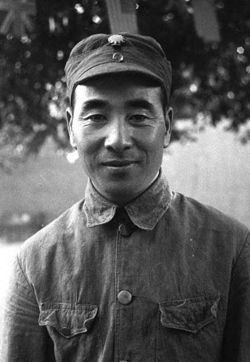
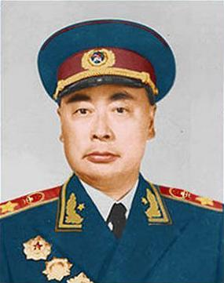
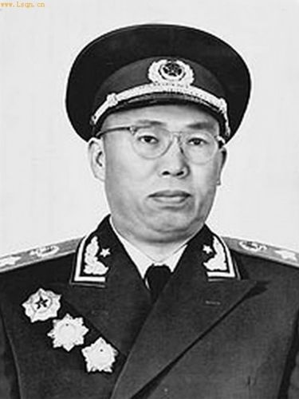
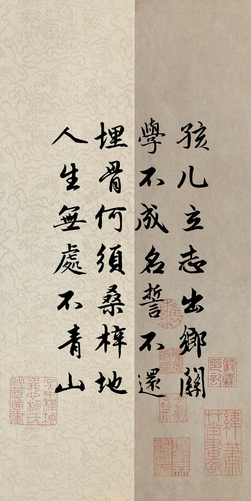

#### 诉衷肠（赠周恩来）

> 
>  诉衷肠（赠周恩来） 
> 
>  作者：毛泽东
>
>  
> 
> 当年忠贞为国酬，何曾怕断头？
> 
> 如今天下红遍，江山靠谁守？
> 
> 业未就，身躯倦，鬓已秋。
> 
> 你我之辈，忍将夙愿，付与东流？
>
> 
>
> 

#### 七律:林彪

> 
>  七律:林彪 
> 
>  作者：缠中说禅
>
>  
> 
> 神州万里遍旗林，河汉遥传鬼魅音。
> 
> 红面老儿疑照眼，黄毛小子计生心。
> 
> 曾经百战喧天地，一夜孤行惑古今。
> 
> 大漠青烟散犹聚，朔风空送血魂吟。
>
> 
>
> 
> 

> 
> 
> 
> 

> 
> 
>
> 

#### 梅岭三章

> 
>  梅岭三章 
> 
>  作者：陈毅
>
>  _一九三六年冬，梅山被围。余伤病伏丛莽间二十余日，虑不得脱，得诗三首留衣底。旋围解。_
>
>  
>
> **其一**
> 
> 断头今日意如何?创业艰难百战多
> 
> 此去泉台招旧部，旌旗十万新阎罗
>
> **其二**
> 
> 南国烽烟正十年，此头须向国门悬。
> 
> 后死诸君多努力，捷报飞来当纸钱。
>
> **其三**
> 
> 投身革命即为家，血雨腥风应有涯
> 
> 取义成仁今日事，人间遍种自由花。
>
> 
> 
> 

> 
> 

> 
> 
> 

#### 七律:吊罗荣桓同志

> 
>  七律:吊罗荣桓同志 
> 
>  作者：毛泽东
>
>
>  
>
> 记得当年草上飞，红军队里每相违。
>
> 长征不是难堪日，战锦方为大问题。
>
> 斥鷃每闻欺大鸟，昆鸡长笑老鹰非。
>
> 君今不幸离人世，国有疑难可问谁？
> 
> 
> 
> 

> 
> 

>
> 
> 

#### 七绝·改诗赠父亲

> 
>  七绝·改诗赠父亲 
> 
>  作者：毛泽东
>
>
>  
>
> 孩儿立志出乡关，学不成名誓不还。
> 
> 埋骨何须桑梓地，人生无处不青山。
> 
> 
> 
> 

> 
> 

> 
> 
> 

#### 满江红·和郭沫若同志

> 
>  满江红·和郭沫若同志 
> 
>  作者：毛泽东
> 
>  
>
> 小小寰球，有几个苍蝇碰壁。
>
> 嗡嗡叫，几声凄厉，几声抽泣。
>
> 蚂蚁缘槐夸大国，蚍蜉撼树谈何易。
>
> 正西风落叶下长安，飞鸣镝。
>
> 多少事，从来急；
>
> 天地转，光阴迫。
>
> 一万年太久，只争朝夕。
>
> 四海翻腾云水怒，五洲震荡风雷激。
>
> 要扫除一切害人虫，全无敌。
> 
> 
>
> 
> 

#### 七律·和郭沫若同志

> 
>  七律·和郭沫若同志 
> 
>  作者：毛泽东
> 
>  
>
> 一从大地起风雷，便有精生白骨堆。
>
> 僧是愚氓犹可训，妖为鬼蜮必成灾。
>
> 金猴奋起千钧棒，玉宇澄清万里埃。
>
> 今日欢呼孙大圣，只缘妖雾又重来。
> 
> 
>
> 
> 

#### 七律·忆重庆谈判

> 
>  七律·忆重庆谈判 
> 
>  作者：毛泽东
> 
>  
>
> 有田有地皆吾主，无法无天是为民。
> 
> 重庆有官皆墨吏，延安无土不黄金。
> 
> 炸桥挖路为团结，夺地争城是斗争。
> 
> 遍地哀鸿满城血，无非一念救苍生。
> 
> 
>
> 
> 

#### 七律·人民解放军占领南京

> 
>  七律·人民解放军占领南京 
> 
>  作者：毛泽东
> 
>  
>
> 钟山风雨起苍黄，百万雄师过大江。
>
> 虎踞龙盘今胜昔，天翻地覆慨而慷。
>
> 宜将剩勇追穷寇，不可沽名学霸王。
>
> 天若有情天亦老，人间正道是沧桑。
> 
> 
>

#### 七律·到韶山

> 
>  七律·到韶山 
> 
>  作者：毛泽东
> 
>  
>
> 别梦依稀咒逝川，故园三十二年前。
>
> 红旗卷起农奴戟，黑手高悬霸主鞭。
>
> 为有牺牲多壮志，敢教日月换新天。
>
> 喜看稻菽千重浪，遍地英雄下夕烟。
> 
> 
>

#### 水调歌头·游泳

> 
>  水调歌头·游泳 
> 
>  作者：毛泽东
> 
>  
>
> 才饮长沙水，又食武昌鱼。
>
> 万里长江横渡，极目楚天舒。
>
> 不管风吹浪打，胜似闲庭信步，
>
> 今日得宽馀。
>
> 子在川上曰：逝者如斯夫！
>
> 风樯动，龟蛇静，起宏图。
>
> 一桥飞架南北，天堑变通途。
>
> 更立西江石壁，截断巫山云雨，高峡出平湖。
>
> 神女应无恙，当惊世界殊。
> 
> 
>

#### 七绝·为女民兵题照

> 
>  七绝·为女民兵题照 
> 
>  作者：毛泽东
> 
>  
>
> 飒爽英姿五尺枪，曙光初照演兵场。
>
> 中华儿女多奇志，不爱红装爱武装。
> 
> 
>

#### 水调歌头·重上井冈山

> 
>  水调歌头·重上井冈山 
> 
>  作者：毛泽东
> 
>  
>
> 久有凌云志，重上井冈山。
>
> 千里来寻故地，旧貌变新颜。
>
> 到处莺歌燕舞，更有潺潺流水，高路入云端。
>
> 过了黄洋界，险处不须看。
>
> 风雷动，旌旗奋，是人寰。
>
> 三十八年过去，弹指一挥间。
>
> 可上九天揽月，可下五洋捉鳖，谈笑凯歌还。
>
> 世上无难事，只要肯登攀。
> 
> 
>
> 
> 

#### 念奴娇·昆仑

> 
>  念奴娇·昆仑 
> 
>  作者：毛泽东
> 
>  
>
> 横空出世，莽昆仑，阅尽人间春色。
>
> 飞起玉龙三百万，搅得周天寒彻。
>
> 夏日消溶，江河横溢，人或为鱼鳖。
>
> 千秋功罪，谁人曾与评说？
>
> 而今我谓昆仑：不要这高，不要这多雪。
>
> 安得倚天抽宝剑，把汝裁为三截？
>
> 一截遗欧，一截赠美，一截还东国。
>
> 太平世界，环球同此凉热。
> 
> 
>
> 
> 

#### 七律二首·送瘟神·其一

> 
>  七律二首·送瘟神·其一 
> 
>  作者：毛泽东
> 
>  
>
> 绿水青山枉自多，华佗无奈小虫何！
>
> 千村薜荔人遗矢，万户萧疏鬼唱歌。
>
> 坐地日行八万里，巡天遥看一千河。
>
> 牛郎欲问瘟神事，一样悲欢逐逝波。
> 
> 
>
> 
> 

#### 七律二首·送瘟神·其二

> 
>  七律二首·送瘟神·其二 
> 
>  作者：毛泽东
> 
>  
>
> 春风杨柳万千条，六亿神州尽舜尧。
>
> 红雨随心翻作浪，青山着意化为桥。
>
> 天连五岭银锄落，地动三河铁臂摇。
>
> 借问瘟君欲何往，纸船明烛照天烧。
> 
> 
>
> 
> 

